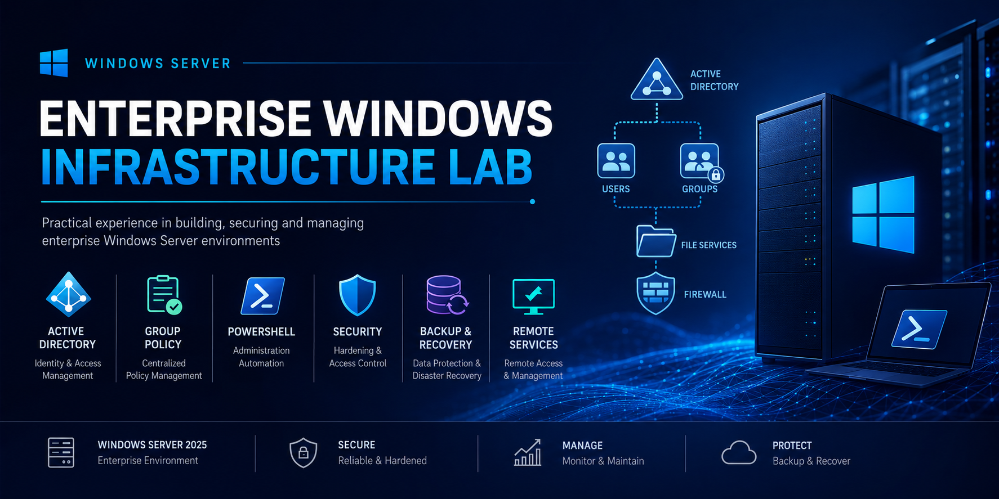

  

 

<h1 align="center">Enterprise Windows Infrastructure Lab</h1>

  <strong>Windows Server Administration • Active Directory • Security • PowerShell • Backup & Recovery</strong>

  Enterprise-level Windows Server laboratory environment demonstrating practical system administration, security management and domain services deployment.

# Overview

This repository contains a comprehensive Windows Server infrastructure project built in a virtual enterprise environment.

The purpose of this project was to gain practical experience with technologies commonly used in corporate IT infrastructures and to develop hands-on skills required for Windows System Administration roles.

The environment includes identity management, access control, security configuration, backup operations, remote administration and monitoring solutions based on Microsoft Windows Server technologies.

---

# Business Scenario

A growing organization requires a centralized and secure infrastructure capable of managing employees, protecting corporate resources and maintaining service availability.

As the Windows System Administrator, the objective was to design, deploy and manage a domain-based environment that provides:

* Centralized user authentication
* Role-based access control
* Secure resource management
* Remote administration capabilities
* Security policy enforcement
* Data protection and encryption
* Backup and disaster recovery procedures
* Infrastructure monitoring and troubleshooting

The final solution delivers a manageable, secure and scalable environment that reflects common enterprise administration practices.

---

# Lab Environment

| Component           | Description                        |
| ------------------- | ---------------------------------- |
| Operating System    | Windows Server 2025                |
| Directory Service   | Active Directory Domain Services   |
| Domain Environment  | WS.LOCAL                           |
| Administration Tool | PowerShell                         |
| Security Platform   | Windows Defender Firewall          |
| Encryption          | BitLocker                          |
| Remote Access       | Remote Desktop Services            |
| Backup Solution     | Windows Server Backup              |
| Monitoring          | Event Viewer & Hardware Monitoring |

---

# Infrastructure Components

## Active Directory Administration

* Domain User Management
* Security Group Management
* Organizational Unit Administration
* User Logon Restrictions
* Authentication Management
* Role-Based Access Control (RBAC)

### Implemented Tasks

✔ Created and managed domain users

✔ Configured security groups

✔ Assigned users to organizational roles

✔ Implemented access permissions

✔ Configured user logon policies

---

## Group Policy Management

* Security Policy Configuration
* User Rights Assignment
* Access Control Policies
* Remote Desktop Policy Deployment
* Centralized Configuration Management

### Implemented Tasks

✔ Configured domain policies

✔ Managed security settings

✔ Applied user rights assignments

✔ Implemented policy-based administration

✔ Configured Remote Desktop access through GPO

---

## File and Storage Services

* Shared Folder Administration
* NTFS Permission Management
* Resource Access Control
* Network Resource Sharing

### Implemented Tasks

✔ Created shared folders

✔ Configured permissions

✔ Verified access control functionality

✔ Implemented secure file sharing

---

## Remote Desktop Services

* Remote Administration
* Secure Remote Access
* Network Level Authentication (NLA)

### Implemented Tasks

✔ Installed Remote Desktop Services

✔ Configured Remote Access Policies

✔ Enabled Network Level Authentication

✔ Configured firewall exceptions

✔ Verified remote connectivity

---

## Security Administration

* BitLocker Drive Encryption
* Windows Defender Firewall
* Security Hardening
* Resource Protection

### Implemented Tasks

✔ Configured BitLocker encryption

✔ Protected operating system drives

✔ Created firewall rules

✔ Applied security best practices

✔ Secured organizational resources

---

## Backup and Recovery

* Windows Server Backup
* Scheduled Backup Operations
* Disaster Recovery Procedures
* Group Policy Backup and Restore

### Implemented Tasks

✔ Configured scheduled backups

✔ Performed backup testing

✔ Executed recovery operations

✔ Backed up Group Policy Objects

✔ Verified restore functionality

---

## Monitoring and Diagnostics

* Event Viewer Analysis
* Hardware Monitoring
* Log Investigation
* Troubleshooting

### Implemented Tasks

✔ Analyzed system logs

✔ Investigated warnings and errors

✔ Monitored hardware health

✔ Reviewed shutdown and reboot events

✔ Performed system diagnostics

---

## PowerShell Administration

* Feature Management
* Service Management
* Event Log Analysis
* Administrative Automation

### Implemented Tasks

✔ Managed Windows features

✔ Queried system services

✔ Analyzed event logs

✔ Performed administrative operations using PowerShell

---

# Technical Skills Demonstrated

### Windows Infrastructure

* Windows Server Administration
* Active Directory Domain Services
* Organizational Unit Management
* User and Group Administration
* Identity and Access Management (IAM)

### Security Administration

* Group Policy Management
* User Rights Assignment
* Windows Defender Firewall
* BitLocker Encryption
* Security Hardening

### Systems Administration

* Remote Desktop Services
* File Services Administration
* Backup and Recovery
* Monitoring and Diagnostics

### Automation

* PowerShell Administration
* Service Management
* Event Log Analysis
* Administrative Scripting

---

# Project Documentation

| Documentation                              |
| ------------------------------------------ |
| Active Directory User and Group Management |
| Windows Security and Policy Management     |
| PowerShell and Server Administration       |
| File Server, BitLocker and Print Services  |
| Remote Desktop Services and Group Policy   |
| Backup, Recovery and Monitoring            |
| Firewall and System Monitoring             |

---

# Professional Competencies

* Enterprise Windows Administration
* Identity and Access Management
* Security Configuration Management
* Infrastructure Support
* Access Control Implementation
* Remote Administration
* Backup and Recovery Planning
* Monitoring and Troubleshooting
* Technical Documentation
* PowerShell Administration

---

# Project Outcome

This project demonstrates practical experience with the deployment, administration and maintenance of a Windows Server domain environment.

The completed work reflects real administrative workflows involving identity management, security enforcement, access control, backup operations, remote administration and infrastructure monitoring.

The project showcases foundational competencies expected from:

* Junior Windows System Administrator
* Infrastructure Support Engineer
* IT Systems Administrator
* Technical Support Engineer
* IT Operations Specialist

---

# Author

**Nurzhas Bolatbekov**

---

Built with Microsoft Windows Server Technologies

